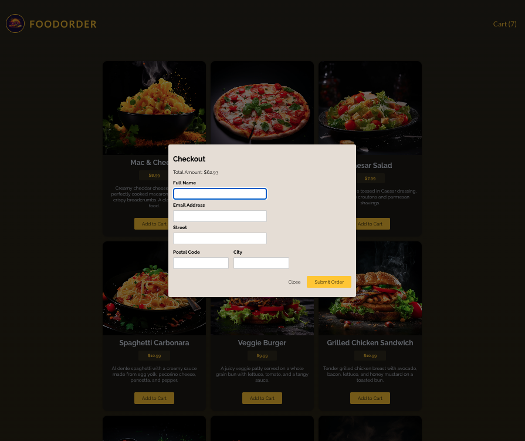

# Food Order App 🍔

A food ordering project with the ability to select dishes, add them to the cart, and place an order.

## 🖼️ Screenshots
### Main page


### Cart


### Order



## 🔥 Features

- **Available Dishes**:
  - Mac & Cheese
  - Margherita Pizza
  - Caesar Salad
  - Spaghetti Carbonara
  - Veggie Burger
  - Grilled Chicken Sandwich
  - And much more.
- **Cart**:
  - Add items to the cart.
  - Remove items to the cart.
  - Change the quantity of items.
- **Order Placement**:
  - Provide contact information.
  - Add a delivery address.

## ⚙️ Technologies

- **Backend**: Node.js, Express.js.
- **Frontend**: React 19.

## 🚀 How to Run the Project

### 1. Clone the Repository

Clone the project from GitHub:

```bash
git clone https://github.com/gudzsv/food-order.git
```
### 2. Run the Frontend
1. Install dependencies:
	```bash
	npm i
	 ```
2. Start the frontend:
   ```bash
	 npm run dev
	 ```
3. Open the link provided in the terminal.


### 3. Run the Backend
Open a separate terminal, navigate to the backend folder:

1. Change directory:
	```bash
	cd backend
	```
2. Install dependencies:
	```bash
	npm i
	```
3. Start the server:
	```bash
	npm start
	```

## 📩 Contact
If you have any questions or suggestions, feel free to reach out to me via GitHub or other channels.
